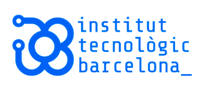
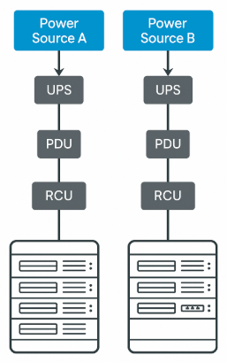
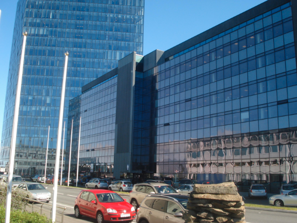
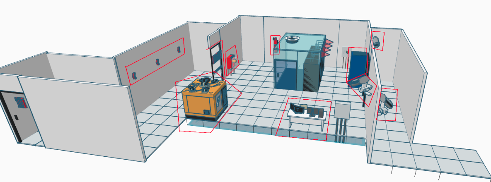
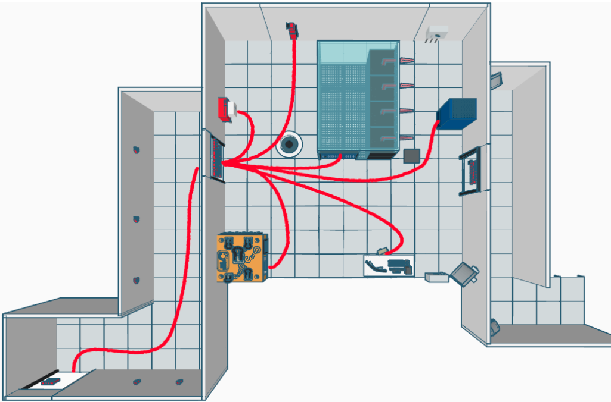

# G2 - Projecte Transversal  
 

  
## PROJECTE TRANSVERSAL

### ASIXc 1 A

1. **Proposta de CPD sostenible**
2. **Disseny d'infraestructura elèctrica**
3. **Disseny d'infraestructura IT**
4. **Disseny d'infraestructura Sostenibilitat**
5. **Disseny d'infraestructura Ubicació física**
6. **Disseny d'infraestructura física i lògica**
7. **Comparacions Clouds**
8. **Implementació de servei àudio i vídeo**
9. **Servidor BBDD**
10. **Servidor Backups**
11. **Servidor Monitorització**
12. **Servidor Web**
13. **Servidor NFS**
14. **Sostenibilitat**
_________________________________________________________________________  

 
     
# 1. Proposta de CPD sostenible  

## 🔧 1. Infraestructura física

### Ubicació i entorn
El CPD està ubicat a Reykjavík (Islàndia), aprofitant el clima fred natural de la regió per reduir el consum energètic de refrigeració. La sala del CPD es troba al soterrani de l’edifici per garantir una temperatura estable, menor exposició a riscos físics externs i una millor protecció contra desastres naturals.

### Condicions ambientals
- **Temperatura:** 20–22 °C
- **Humitat relativa:** 45–55%
- **Climatització natural assistida amb aire exterior filtrat**
- **Sistemes de neteja de l’aire:** filtres HEPA i sensors de partícules

### Distribució
- **2 racks de 42 U** amb separació d’1 metre
- **Terra tècnic** de 40 cm per a cablejat, sensors i refrigeració
- **Sostre tècnic** amb detectors d’incendis, ventilació i il·luminació LED
- **Racks** amb accés frontal i posterior, amb sistema de tancament segur

## ⚡ 2. Infraestructura elèctrica

### Alimentació elèctrica eficient
- **Font principal** amb energia renovable (gràcies a la ubicació a Islàndia)
- **UPS (SAI)** de liti Eaton 9PX per garantir estabilitat i eficiència
- **Distribució elèctrica** separada de les dades per evitar interferències
- **Monitoratge constant** del consum energètic

### Redundància
- **SAI secundari** per garantir disponibilitat
- **Possibilitat d’integració** amb panells solars o altres fonts verdes en futur

### Il·luminació
- **Sistemes LED** d’alt rendiment amb sensors de presència

## 🔐 3. Seguretat física i lògica

### Seguretat física
- **Accés controlat** per sistemes biomètrics
- **Porta ignífuga certificada**
- **Càmeres IP** amb gravació contínua al passadís d’accés
- **Sense cartelleria visible** ni identificació de la sala
- **Aïllament acústic** per evitar detecció externa d’activitat

### Seguretat lògica
- **Tallafocs dedicat** abans del core switch
- **Segmentació de xarxes** (VLANs per serveis, usuaris, etc.)
- **Sistemes de monitoratge actiu:** Zabbix / Grafana
- **Connexió segura** a cloud amb VPN i xifratge TLS
- **Backups automatitzats** i replicats  

 
 

  
# 2. Disseny d'infraestructura elèctrica

## 🔁 1. Sistemes d’alimentació redundant
Per garantir la disponibilitat i continuïtat del servei, la infraestructura tindrà:
- ✔️ **Doble línia d'alimentació elèctrica:**
  - Línia principal de la xarxa elèctrica.
  - Línia secundària connectada a un SAI (UPS) i posteriorment a un generador (opcional per CPDs grans).
- ✔️ **Distribució elèctrica** amb PDU doble als racks per permetre la connexió redundant a cada servidor.
- ✔️ **Connexió dels servidors** a dues fonts d’alimentació independents.

## 🔋 2. Sistemes d'alimentació ininterrompuda (SAI / UPS)
### ✔️ Eaton 9PX 3000VA Lithium-Ion UPS
- **Potència:** 3000 VA / 2700 W
- **Tecnologia:** Doble conversió online
- **Eficiència energètica:** >95%
- **Bateries de liti:** Durada 8-10 anys
- **Admet mòduls d’expansió de bateries (EBM)**

## 3. Càlcul de consum i autonomia
| Dispositiu                           | Consum estimat (W) |
|--------------------------------------|---------------------|
| Dell PowerEdge R450                  | 300 W               |
| HPE ProLiant DL360 Gen11             | 400 W               |
| Synology RS1221+ (NAS)               | 100 W               |
| Cisco Catalyst 9300                  | 150 W               |
| Ubiquiti UniFi Switch 24 PoE         | 250 W               |
| **Total estimat**                    | **1.200 W**         |

### 🔋 Autonomia amb Eaton 9PX 3000VA (2700 W):
- **Càrrega de 1200 W:** 10-12 minuts
- **Amb 1–2 mòduls EBM:** fins a 30-40 minuts

### 🎯 Objectiu recomanat:
Garantir mínim 15 minuts per aturar serveis o activar generador.

### ✅ Configuració recomanada:
- 2 × Eaton 9PX 3000VA (1 per línia elèctrica)
- 1–2 × EBM (expansió bateries)
- 2 × PDU per rack (una per línia elèctrica)

## 🔌 4. Mòduls PDU recomanats (eficients i compatibles)
### ✅ Característiques sostenibles:
- **Alta eficiència** (Metered o Switched)
- **Format vertical** 0U o 1U
- **Control remot** i monitoratge
- **Certificacions** (RoHS, Energy Star)

### 🔹 Model A: Eaton ePDU G3 Managed – EMAB
- **Format:** 0U (vertical)
- **Sortides:** 24 x C13 + 6 x C
- **Potència:** Fins a 22 kW, 230V
- **Control:** Gestió per presa via Ethernet

### 🔹 Model B: Vertiv Geist™ Switched Rack PDU – VP7N30AP
- **Format:** 0U (vertical)
- **Sortides:** 24 preses combinades C13/C
- **Capacitat:** 30A, 208V / 4.9 kW
- **Gestió:** Control remot per presa i pantalla LCD d'alta visibilitat  
 

## 🔧 5. Esquema elèctric del CPD (explicació visual i textual)
[Xarxa Elèctrica Principal]  
↓  
┌─────────────────────┐  
│       Línia A      │  
└─────────────────────┘  
↓  
[SAI A – Eaton 9PX]  
↓  
[PDU A – Eaton EMAB33]  
↓  
[Servidor 1] PSU A  
[Servidor 2] PSU A  
[...]  
  
┌─────────────────────┐  
│       Línia B      │  
└─────────────────────┘  
↓  
[SAI B – Eaton 9PX]  
↓  
[PDU B – Eaton EMAB33]  
↓  
[Servidor 1] PSU B  
[Servidor 2] PSU B  
[...]  
  
## 🌱 Aspectes sostenibles
- Bateries de liti → vida útil més llarga, menys manteniment.
- Alta eficiència energètica (>95%) → menys pèrdua en conversió.
- Control intel·ligent del consum → adaptació de càrrega en temps real.
- Reducció de la petjada ecològica → menys residus de bateries, menys refrigeració necessària.

## 📦 Resum de components elèctrics recomanats
| Component                      | Quantitat | Notes                                       |
|-------------------------------|-----------|---------------------------------------------|
| Eaton 9PX 3000VA UPS          | 2         | Redundància (una per línia elèctrica)      |
| Mòdul d'expansió EBM          | 1–2       | Per ampliar autonomia a 30 minuts            |
| Eaton o Vertiv PDU (0U)       | 2         | Permet doble alimentació a cada rack        |  

 
 

  
# 3-Disseny d'infraestructura IT

✅ **1. Servidors**

Tot i que la major part de la infraestructura residirà al núvol, InnovateTech disposarà d’una
petita infraestructura local (on-premise) per a serveis crítics o backup local.

| Funció del servidor                      | Model suggerit                   | Característiques clau                                                             |
|-----------------------------------------|----------------------------------|----------------------------------------------------------------------------------|
| Servidor d’emmagatzematge (NAS)       | Synology RS1221+                 | CPU AMD Ryzen, 8 bay, eficiència energètica, per a backup local.                 |
| Servidor de virtualització local        | HPE ProLiant DL360 Gen          | CPU Intel Xeon Scalable, eficiència energètica, suport per VM i containers.      |
| Servidor de monitoratge / gestió local  | Dell PowerEdge R                 | Baix consum, per a eines com Zabbix/Grafana.                                    |

🔌 **2. Patch Panels**

Els patch panels serveixen per organitzar i estructurar el cablejat de xarxa. Es recomana
l’ús de:

- 24 ports Cat6A UTP Keystone Patch Panels
- Marca recomanada: Panduit o Digitus
- Avantatges:
  - Preparats per connexions 10Gbps
  - Baixa latència
  - Suport per a color coding i etiquetatge

🌐 **3. Switches**

Per una xarxa eficient i amb capacitat per gestionar transmissió de dades multimèdia (streaming):

**Switch Core:**

- Cisco Catalyst 9300 o Ubiquiti UniFi Aggregation Switch
  - 10/40 Gbps uplinks
  - Alta disponibilitat i suport PoE+
  - Gestió centralitzada

**Switches d'accés:**

- Ubiquiti UniFi Switch Pro 24 PoE
  - 24 ports PoE+ (per a APs i dispositius IP)
  - Baix consum i silenci acústic

🔋 **4. SAI (UPS) amb bateries de liti**

- Eaton 9PX Lithium-Ion UPS
  - SAI de doble conversió amb bateries de liti, que ofereix una vida útil més llarga i menor manteniment.
  - Eficiència energètica de fins al 98%, ideal per a entorns crítics.
  - Més informació: Eaton 9PX Lithium-Ion UPS

📦 **5. Distribució als racks**

→ **RACK 1: SERVEIS CRÍTICS I CORE**

| Posició | Equipament                                  |
|---------|---------------------------------------------|
| U1-U2   | Switch Core (Cisco Catalyst 9300)          |
| U3      | Patch Panel (24 ports Cat6A)               |
| U4-U6   | Servidor HPE ProLiant DL360 Gen11          |
| U7-U9   | NAS Synology RS1221+                        |
| U10     | Servidor Dell PowerEdge R450 (monitoratge) |
| U11     | Patch Panel (24 ports Cat6A)               |
| U12     | SAI (UPS) amb bateries de liti eficients    |

→ **RACK 2: COMUNICACIONS I BACKUP**

| Posició | Equipament                                    |
|---------|-----------------------------------------------|
| U1-U2   | Switch d'accés (UniFi Switch Pro 24 PoE)     |
| U3      | Patch Panel (24 ports)                        |
| U4      | Patch Panel (fibra multimode LC/LC)          |
| U5      | SAI secundari                                 |
| U6      | Espai de reserva / futur creixement           |

📊 **Esquema de distribució (resum)**

[Internet]  
   ↓  
[Router de proveïdor]  
   ↓  
[Firewall]  
   ↓  
[Catalyst 9300 Switch (Core)]  
   ↓  
────────────┬─────────────┐  
    ↓                ↓  
[Switch Ubiquiti PoE] [Servidors]  
↓  
[Punts d'accés WiFi / APs]  

♻️ **Aspectes sostenibles destacats**

- Equipament amb etiquetatge energètic (80 PLUS, Energy Star).
- Refrigeració passiva o de baix consum.
- Sistemes de monitoratge energètic.
- Servidors amb opcions de gestió intelligentcooling.
- Integració amb proveïdors Cloud que ofereixen serveis amb energia renovable (AWS, Azure, Google Cloud).  

 
 

# 4-Disseny d'infraestructura Sostenibilitat

1. ✅ **Per què Islàndia és ideal per a un CPD eficient energèticament?**

- **És 100% energia renovable:** Islàndia produeix pràcticament tota la seva energia amb fonts netes: geotèrmica i hidroelèctrica. Això redueix notablement la petjada de carboni associada al funcionament del CPD.

- **Condicions climàtiques favorables:** temperatures baixes durant tot l’any permeten implementar refredament natural sense grans costos de refrigeració mecànica.
  
- **Estabilitat geopolítica i infraestructura de dades:**
  - Connexió amb Europa i Amèrica a través de cables submarins.
  - Legislació estable i bones polítiques de protecció de dades.

1.1- ♻️ **Compliment ambiental i avantatges de tenir servidors a Islàndia**

Islàndia facilita el compliment de normatives internacionals com l'ISO 14001, enfocada a sistemes de gestió ambiental, i iniciatives ESG (Environmental, Social, Governance), que valoren el compromís sostenible i ètic de les organitzacions.

- Permet operar amb una emissió de CO₂ pràcticament nul·la, contribuint a objectius ambientals corporatius o educatius.
- Reducció de costos operatius gràcies a l’energia renovable barata i estable.
- Condicions físiques segures i baix risc de desastres naturals (terratrèmols, incendis, etc.).

1.2- ☁️ **Integració amb AWS (regió més propera)**

Tot i que AWS no té una regió oficial a Islàndia, es pot fer servir la regió d’Estocolm (Suècia) com a punt més proper. Aquesta regió és també molt eficient energèticament i utilitza energia 100% renovable.

**Servei AWS suggerit per al CPD virtual:**
- Amazon EC2 (amb Graviton): instàncies d’alt rendiment amb consum energètic reduït.

1.3- 🌿 **Compliment dels requisits ambientals**

Per maximitzar l’eficiència i sostenibilitat del CPD es poden aplicar les següents mesures:

- Ús d’energia verda per alimentar el CPD.
- Estalvi en cablejat col·locant equips de manera estratègica.
- Sistemes de circulació d’aire que aprofitin les condicions naturals per al refredament.
- Parada automàtica d’equips de xarxa i comunicació quan no hi ha càrrega.
- Ús d’equips de baix consum energètic i eficients a nivell de maquinari.  

 
 

# 5-Disseny d'infraestructura Ubicació física

## Ubicació física

**Situació física de la sala a l’edifici**

El Centre de Processament de Dades (CPD) d’InnovateTech està ubicat a la ciutat de Reykjavík, Islàndia, dins de l’edifici Höfðatorg, al centre financer i administratiu de la capital. La sala del CPD es troba a la planta subterrània de l’edifici, una zona fresca i protegida que garanteix estabilitat tèrmica i seguretat física. Aquesta planta està dedicada exclusivament a infraestructures crítiques i disposa de sistemes de control d’accés biomètric per evitar intrusions no autoritzades.
 

 
## Sistemes de climatització

Gràcies al clima fred natural d’Islàndia (temperatura mitjana anual de 5 °C), el CPD pot implementar un sistema de refrigeració natural assistida, amb circulació d’aire exterior filtrat. Això redueix la dependència de sistemes actius i el consum energètic global.

Els paràmetres ambientals es mantenen estables:

- **Temperatura:** 20–22 °C
- **Humitat relativa:** 45–55%
- **Neteja de l’aire:** filtres HEPA i sensors de partícules en suspensió

## Mesures per dificultar la identificació de la sala

Per garantir una seguretat física elevada:

- L’accés està restringit amb cartell “Accés Restringit”, i controlat per lectors biomètrics.
- El passadís d’accés està vigilat per càmeres IP amb gravació contínua.
- S’aplica aïllament acústic per evitar identificar l’activitat des de l’exterior.

## Distribució i gestió del cablejat

El cablejat estructurat segueix l’estàndard CAT6A per xarxes de 10 Gbps:

- Separació clara entre energia i dades.
- Cablejat identificat amb etiquetes codificades per color.
- Es disposen guies de cable horitzontals i verticals als racks.
- Els cables passen per sota del terra tècnic, minimitzant interferències i afavorint el manteniment.

## Terra tècnic i sostre tècnic

- **Terra tècnic elevat de 40 cm** per distribuir cables, sistemes de refrigeració i sensors.
- **Sostre fals tècnic amb:**
  - Sistemes de detecció d’incendis (sensors òptics i tèrmics).
  - Conductes de ventilació.
  - Il·luminació LED d’alt rendiment.

## Estructuració dels racks

Es disposen 2 racks de 42U segons la següent configuració:

🔹 **Rack 1: Xarxes i sistemes**

- Switch de core (48 ports).
- Router amb firewall dedicat.
- 6 servidors físics (virtualització amb Proxmox).
- Patch panels.
- Sistema d’alimentació ininterrompuda (SAI).

🔹 **Rack 2: Serveis**

- Servidor de bases de dades (MySQL o RDS AWS).
- Servidor de streaming d’àudio (Icecast).
- Servidor de vídeo (GStream).
- Sistema de còpies de seguretat.
- Monitoratge (Grafana).
- Servidor Web (Apache).
- Servidor NFS.  

 
 

# 6-Disseny d'infraestructura física i lògica

## Seguretat física

Per garantir la protecció de les instal·lacions i equips crítics del CPD, s'han incorporat els següents elements de seguretat:

### Elements de control d’accés

- Accés per targeta magnètica i verificació biomètrica.
- Registre automàtic d’entrades i sortides.
- Zones classificades per nivell d’autorització (CPD, rack, manteniment).

### Videovigilància

- Càmeres IP HD amb visió nocturna en punts estratègics: accessos, passadissos i sala del CPD.
- Gravació contínua amb emmagatzematge redundant (mínim 30 dies).
- Sistema de detecció de moviment i alertes en temps real.

### Prevenció i detecció d’incendis

- Sensors òptics de fum i temperatura.
- Sistema de detecció precoç basat en làser (VESDA).
- Sistema d’extinció automàtic per gas inergen o FM200 (no conductor, no danya equips).
- Polsadors manuals d’alarma i senyalització lluminosa i sonora.

### Vies d’evacuació

- Porta d’emergència ignífuga amb barra antipànic.
- Il·luminació d’emergència en passadissos.

### Diagrames i planells

- Diagrama d’ubicació de càmeres i sensors.
- Vista de les portes d’accés amb controls d’entrada.
- Rutes d’evacuació.

 

### Diagrama CPD:

 
 

### Ruta evacuació:

 

## Seguretat lògica

La protecció digital és fonamental per evitar atacs i garantir la integritat de les dades:

### Restricció d’accés per autorització

- Sistema de rols i permisos per a cada usuari.
- Autenticació de doble factor (2FA).
- Accés mitjançant VPN segura.

### Firewalls

- Firewall perimetral físic (hardware) i firewall de servidor (software).
- Polítiques de filtratge per IP, port i protocol.
- Detecció i prevenció d’intrusions (IDS/IPS).

### Monitoratge

- Sistema de monitoratge centralitzat (Zabbix o CloudWatch si és al núvol).
- Logs d’accés, ús de CPU, RAM, xarxa i alertes d’incidents.
- Supervisió de backups i estats de RAID.

### Còpies de seguretat / Backups

- Còpies automàtiques diàries amb retenció de 7, 14 i 30 dies.
- Backup local al NAS + backup al núvol (S3/Azure).
- Proves periòdiques de restauració.

## Prevenció de riscos laborals (PRL)

La sala CPD compleix amb les mesures de Prevenció de Riscos Laborals exigides per normativa europea:

- Catifa antilliscant i sense obstacles als passadissos tècnics.
- Temperatura i humitat ambient regulada per evitar riscos físics.
- Presència d’un extintor manual accessible i senyalitzat.
- Manual de riscos visible i formació obligatòria del personal autoritzat.
- S'estableixen protocols clars d'actuació en cas d'incident tècnic o elèctric.  

 
 

# 7-Comparacions Clouds

## Comparativa de sostenibilitat i eficiència energètica amb altres proveïdors

| Proveïdor      | % Energia Renovable | Certificacions Sostenibles                     | Tecnologies d’Eficiència                     | Comentaris                                           |
|----------------|---------------------|------------------------------------------------|----------------------------------------------|-----------------------------------------------------|
| **AWS**        | 100% (previst 2025) | ISO 14001, ISO 50001, EnergyStar, CarbonNeutral | Graviton (ARM), Regions optimitzades, refrigeració avançada | Ofereix informes de sostenibilitat per client       |
| **Microsoft Azure** | 100% (assolit)   | LEED, ISO 14001, Zero Carbon Certifications     | Data centers amb refrigeració líquida, AI per optimització | Compensa emissions indirectes; pioner en transparència |
| **Google Cloud** | 100% des de 2017  | Carbon Free Energy Tracking, ISO 50001         | Data centers hiper-eficients amb machine learning | Compte amb sistema de monitoratge energètic avançat |
| **OVHcloud**   | 77%                 | ISO 50001, ISO 14001                           | Refrigeració per aigua, reutilització de calor | Data centers propis optimitzats a Europa             |

## ODS: Com cobreixen els requisits de sostenibilitat del projecte

| ODS                           | AWS      | Azure    | Google Cloud          |
|------------------------------|----------|----------|----------------------|
| **ODS 7 Energia neta**       | Sí – 100% renovable el 2025 | Sí       | Sí (des de 2017)     |
| **ODS 9 Infraestructura**    | Escalabilitat, alta disponibilitat | Igual    | Igual                |
| **ODS 12 Consum responsable** | Eficiència per instància, informes per client | Control d’impacte | Analítica detallada  |
| **ODS 13 Acció climàtica**   | Neutralitat 2040             | Negatiu en carboni 2030 | Ja 100% sense emissions |
| **ODS 16 Institucions sòlides** | Transparència, compliment normatiu | Alt nivell | Alt nivell           |

## 🌱 Conclusió

AWS permet desplegar una arquitectura CPD al núvol sostenible, escalable i altament disponible, gràcies als seus serveis modulars i opcions d’eficiència energètica com instàncies Graviton, regions optimitzades i serveis gestionats.

Tot i que Azure i Google Cloud també ofereixen excel·lents prestacions, AWS destaca per la seva àmplia compatibilitat, gran disponibilitat de serveis multimèdia i el seu compromís amb la neutralitat de carboni per al 2040.  

 
 

# 8-Implementació de servei d'àudio i vídeo

## 1.1. Instalar los paquetes necesarios

## 2. Configuració del servidor Icecast2

El fitxer de configuració és `/etc/icecast2/icecast.xml`.

### 2.1. Establir contraseñas

Aquí hem canviat les contraseñas que usarà el comandament `ffmpeg` per verificar l’enviament del stream.

### 2.2. Afegir un mount point específic

El mount serveix per configurar les propietats del stream.

### 2.3. Icecast2 en funcionament

## 3. Ancho de banda

En el servidor, com farà de receptor, usarem el comandament: iperf3 -s

I en el client, que serà l'emissor, amb el comandament: iperf3 -c 34.197.87.145

 
 

# 9-Disseny i implementació d’una base de dades

- Primer de tot, creem una instància Ubuntu 22.04 des d'AWS.

- Cream una clau, que en aquest cas l’hi posarem "bbdd".

- Una vegada fet això, creem un grup de seguretat.

- Després, afegirem les regles que considerem oportunes; en aquest cas, SSH i MySQL/Aurora, ja que estem fent un servidor de BBDD.

- Després, farem SSH copiant el que tenim, anant a la instància. Anant a on està SSH client, copiem això, ens n'anem a una màquina Ubuntu, donem privilegis, i posem: SSH -i el nom que tingui la clau i el que continuï després

- Ara, farem el pas a pas de la base de dades. Primer instal·lem el `mysql-server`.

- Una vegada instal·lada, comencem a crear la base de dades que es dirà "G2".

- Es comença a crear les taules.

- Inserim els departaments.

- Inserim el grup-nivell.

- Inserim els empleats.

## Explicació de model entitat-relació + gràfic

- **Departament**: És una entitat que representa els departaments de l’empresa. Cada departament té un codi únic (PK), un nom complet i un telèfon.

- **Grup-Nivell**: Representa els grups i nivells laborals. Cada grup té un codi únic (PK) i atributs laborals importants com salari, període de prova i dies de vacances.

- **Empleat**: És l’entitat central, on es guarden les dades personals dels empleats identificats pel DNI (PK). Cada empleat està assignat a un departament (codi_departament, FK) i a un grup-nivell (codi_grupnivell, FK).

 
 

# 10-Servidor Còpies de seguretat

## Comprovacions:

## Creació directoris de backups:

## Configuracions:

## Script Còpies de seguretat del servidor d’àudio i vídeo:

## Script Còpia de seguretat del servidor de Base de Dades:

## Comprovacions Còpies de seguretat:

 
 

# 11-Servidor Monotorització
## Instal·lació i comprovació:

## Arxius configuració:

## Comprovació:

## Configuració de les màquines que monitorarem:

## Configuració del servei:

## Accés al Grafana:

## Configuració:

## Servidor de Còpies de seguretat:

## Servidor d'àudio i vídeo:

## Servidor de Base de Dades:

 
 

# 12-Servidor WEB
## -Creació de la instància Ubuntu 22.04 des d'AWS

## -La clau serà la mateixa que la del server BBDD

## El mateix passa amb el grup de seguretat
## -Donem privilegis a la clau, ens connectem via SSH

## -Comencem a instal·lar el servidor Web que serà el Apache

## -Una vegada instal·lat busquem a l'internet,http:// laIP pública d'AWS

## -Una vegada instal·lat comencem a fer la Web posant per exemple els apartats que tenim

 
 

# 13-Servidor NFS
## Instal·lació i configuració del servidor NFS

## Configuració clients:

## Proves:

## Creació d’un arxiu al client:

## Comprovació al servidor:

 
 

# 14-Sostenibilitat

## Sostenibilitat i eficiència energètica:
Alineant-nos amb els nostres valors empresarials i els ODS, és fonamental per a nosaltres que tot el projecte sigui dissenyat amb un enfocament clar de sostenibilitat. Busquem optimitzar l'ús d'energia i utilitzar solucions que redueixin l'impacte ambiental de les nostres operacions. Ens agradaria explorar l'ús de fonts d'energia renovables, així com la implementació de pràctiques d'eficiència energètica dins del CPD.

## Càlcul de la petjada ecològica del projecte realitzat:

1. **Identificar els recursos emprats:**
   a. **Quins serveis han desplegat (tipus de màquines, serveis de núvol, protocols):**  
      S’han desplegat 4 servidors: el d’àudio i vídeo, el de base de dades, el de les còpies de seguretat i el de monitoratge. Tots quatre al núvol d’Amazon AWS amb Ubuntu Server 22.04. Fent servir els protocols TCP, ICMP, SSH, port 3000, 9100 i 9090. S’han obert per permetre la connexió entre servidors i poder efectuar tant les còpies de seguretat com el monitoratge de forma remota.

   b. **Quins recursos consumeixen (CPU, RAM, emmagatzematge, amplada de banda):**
| Servei                | CPU | RAM   | Emmagatzematge | Amplada de banda |
|-----------------------|-----|-------|----------------|------------------|
| Servidor Àudio i Vídeo| 2   | 8 GB  | 8 GB           | 0,5 Gbps         |
| Servidor BBDD         | 1   | 1 GB  | 8 GB           | 0,25 Gbps        |
| Servidor Backups      | 1   | 1 GB  | 8 GB           | 0,25 Gbps        |
| Servidor Monitoratge   | 1   | 1 GB  | 8 GB           | 0,25 Gbps        |  

c. **Quina és la previsió d’ús (hores de funcionament, usuaris, tràfic estimat):**  
   Està pensat per tenir els servidors 24/7 almenys dues setmanes (el que dura el projecte). Hi haurà 4 usuaris (els integrants del grup). El tràfic estima 10 GB en tot el temps que duri.

2. **Estimar el consum energètic i la petjada de carboni:**
- Estimar el consum energètic de:
  - Les instàncies del núvol (pot utilitzar valors aproximats o eines del proveïdor com la Carbon Footprint Calculator d'AWS o similars de GCP/Azure).
  - El tràfic generat pel streaming (considerant, per exemple, watts per GB transferit).
  - El consum dels servidors virtuals o serveis en funcionament contínuament. Utilitzar factors d’equivalència per convertir energia (kWh) en emissions (kg CO₂ eq.).

**Recursos**: [Carbon Trust](https://www.carbontrust.com/)  
Factors mitjans globals o per regió del proveïdor cloud.

| Element                          | Energia (kWh) | Emissions (kg CO₂eq.) |
|----------------------------------|---------------|-----------------------|
| Instància EC2 (t2.large)        | 8.4           | 3.36                  |
| Tràfic de xarxa (~10 GB)        | 0.05          | 0.02                  |
| Serveis i processos addicionals  | 1.68          | 0.67                  |
| **Total estimat (2 setmanes)**  | **10.13**     | **4.05**              |  

3. **Proposta de mesures de reducció o optimització:**
a. **Reduir hores de funcionament?**  
   **Proposta:** Automatitzar l’aturada de les instàncies fora de l’horari d’ús efectiu (ex. nits o caps de setmana si no hi ha activitat).  
   **Benefici:** Reducció del consum energètic fins a un 30–50%, depenent del patró d’ús real.  
   **Eina recomanada:** AWS Instance Scheduler (programació d’aturades/arrencades).

b. **Utilitzar serveis amb energia renovable?**  
   **Proposta:** Utilitzar regions cloud amb compromís de zero emissions o energia renovable certificada.  
   AWS té regions amb energia verda:
   - Irlanda (eu-west-1)
   - Oregon (us-west-2)
   - Suècia (eu-north-1)  
   GCP i Azure també ofereixen opcions 100% renovables en regions específiques.  
   **Benefici:** Pot reduir la petjada de carboni a pràcticament zero segons el proveïdor.

c. **Triar regions de núvol més eficients?**  
   **Proposta:** Seleccionar regions properes als usuaris per:
   - Minimitzar latència.
   - Reduir el consum de xarxa i potència computacional necessària.  
   Les regions més noves solen tenir infraestructura més eficient energèticament.
